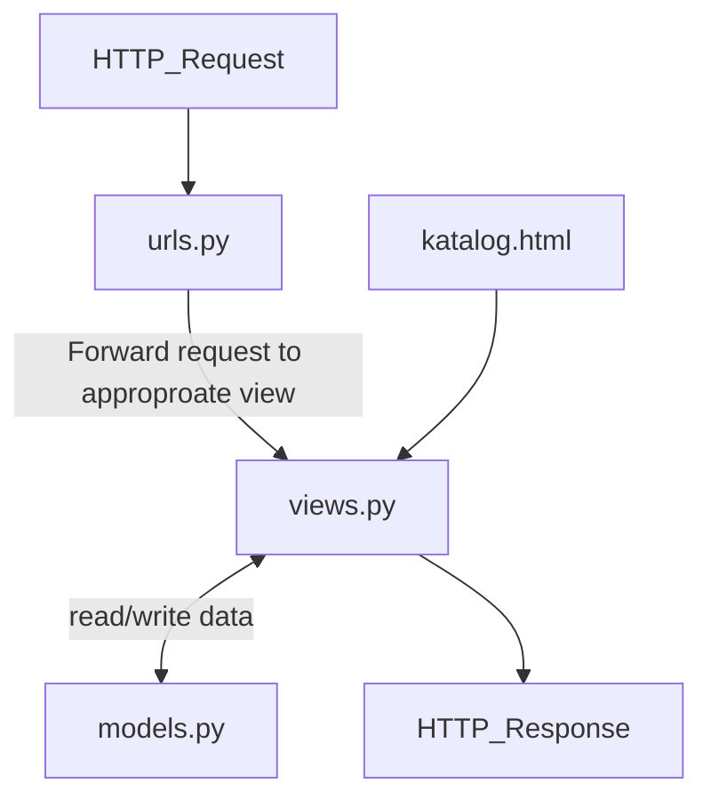

# Link Herokuapp
https://rafighalibinpbptugas2.herokuapp.com/katalog/

# Bagan Request Client

Penjelasan:
Request diminta oleh user ke server, kemudian urls.py akan mengarahkan request ke views.py. Method yang ada di views.py akan mencetak data-data di katalog.html. Data disimpan dalam bentuk class CatalogItem yang ada di models.py. Kemudian server akan mengembalikan Response ke user.

# Mengapa Kita Perlu Menggunakan Virtual Environment?
Dengan menggunakan virtual environment kita akan mendapatkan semacam ruang isolasi untuk menginstall libraries yang dibutuhkan projek kita. Dengan adanya virtual environment kita tidak akan menginstall libraries di sistem operasi kita secara langsung. Keuntungan dari virtual environment kita dapat menggunakan liblary dengan versi yang berbeda untuk projek yang berbeda. Selain itu kita juga bisa dengan muda menduplikat projek karena kita tahu libraries apa saja yang digunakan karena sudah terkumpul di satu ruangan yang terisolasi. Tanpa virtual environment kita masih bisa membuak projek Django namun kita tidak akan mendapatkan keuntungan yang disebutkan diatas.

# Cara Implementasi

Pertama saya clone repository template dan kemudian menjalankan virtual env sekaligus mengistall segala requirement project. Kemudian saya membuat method di views.py yang akan mengambil data dari models sekaligus assigning nama menjadi "Rafi Ghalibin Abrar" dan id menjadi "2106751354", emudian akan meng-render data-data tersebut di katalog.html. Pada file katalog.html saya membuat fields yang bersesuaian dengan data yang ada di views.py sehingga data akan muncul sesuai dengan slot yang tepat. kemudian saya melakukan routing method show_katalog di urls.py agar HTML dapat ditampilkal lewat browser. saya juga mendaftarkan aplikasi kedalam urls yang ada di project_django, setelah itu saya push perubahan ke git. Kemudian untuk mendeploy ke heroku saya menambahkan secret API key dan nama aplikasi. 
