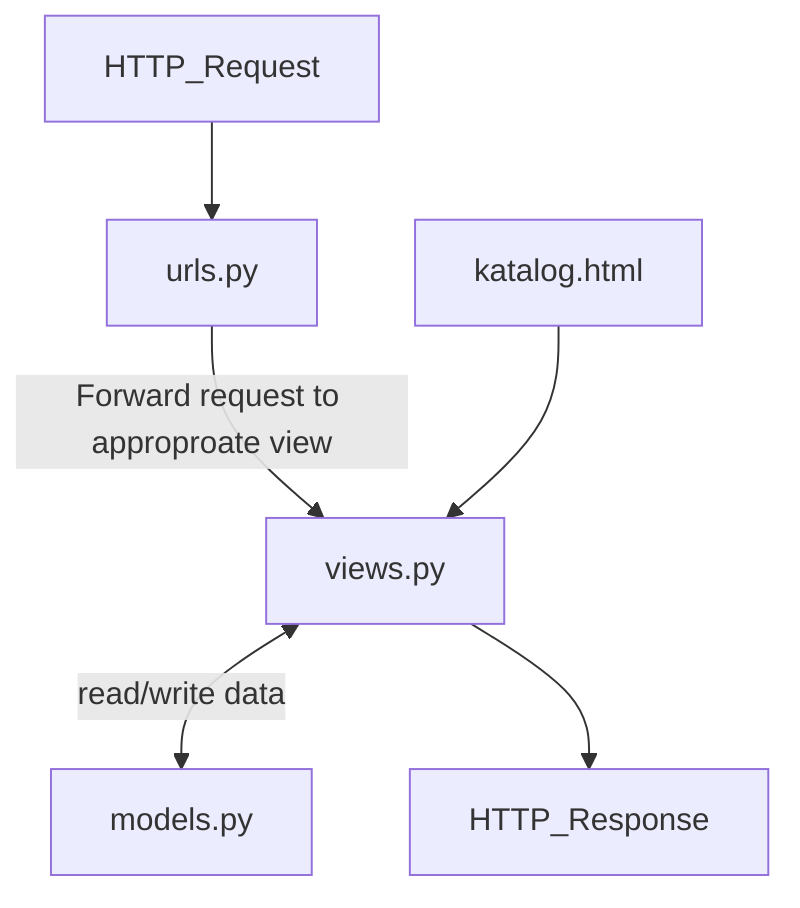
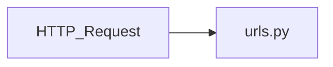
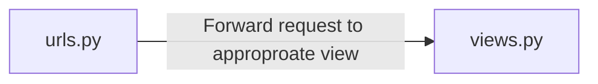
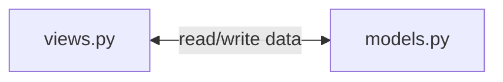
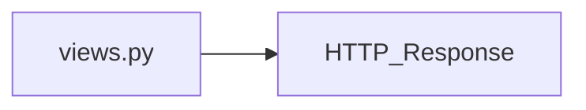
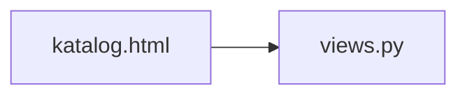

# Link Herokuapp
https://rafighalibinpbptugas2.herokuapp.com/katalog/

# Bagan Request Client

Penjelasan:

1.

2.

3.

4.

5.

# Mengapa Kita Perlu Menggunakan Virtual Environment?
Dengan menggunakan virtual environment kita akan mendapatkan semacam ruang isolasi untuk menginstall libraries yang dibutuhkan projek kita. Dengan adanya virtual environment kita tidak akan menginstall libraries di sistem operasi kita secara langsung. Keuntungan dari virtual environment kita dapat menggunakan liblary dengan versi yang berbeda untuk projek yang berbeda. Selain itu kita juga bisa dengan muda menduplikat projek karena kita tahu libraries apa saja yang digunakan karena sudah terkumpul di satu ruangan yang terisolasi. Tanpa virtual environment kita masih bisa membuak projek Django namun kita tidak akan mendapatkan keuntungan yang disebutkan diatas.
# Cara Implementasi
