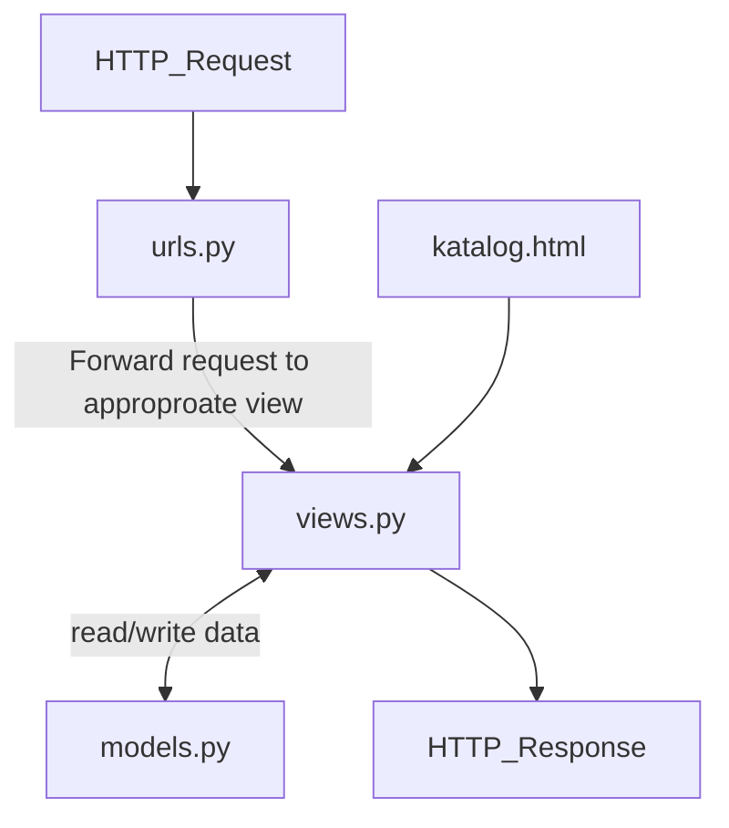
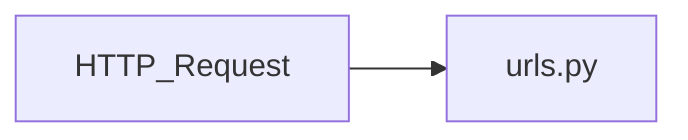
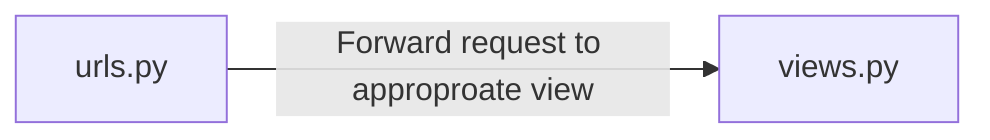
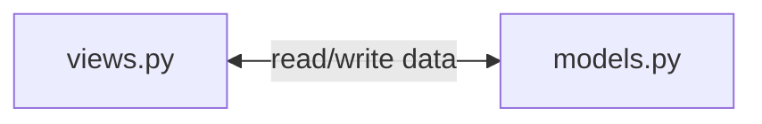
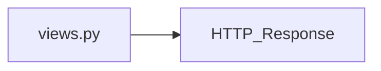
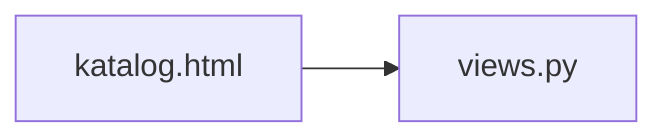

# Link Herokuapp
https://rafighalibinpbptugas2.herokuapp.com/katalog/

# Bagan Request Client

Penjelasan:

1.

2.

3.

4.

5.

# Mengapa Kita Perlu Menggunakan Virtual Environment?

# Cara Implementasi
